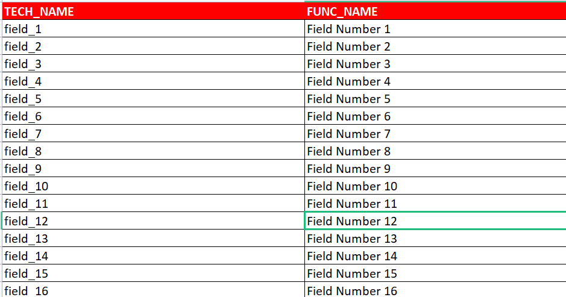
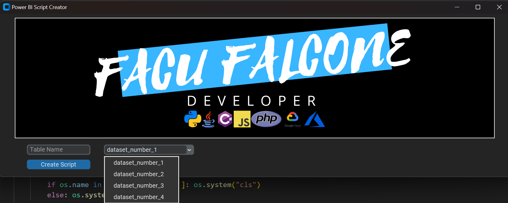

<table>
    <tr>
        <td align='center'>
            
        </td>
    </tr>
    <tr>
        <td align="center">
            
        </td>
    </tr>
</table></br>

---

# Power BI Script Maker
#### Developed by: _Facundo Falcone_ <CaidevOficial>
<br>

### Important: You`ll need Python 3.10.X

### How to use:

As a first step, install the necessary libraries to run the program, for this you must execute the command in the console:

If you use windows:
```bash
py -m pip install -r requirements.txt
```

If you use UNIX:
```bash
python3 -m pip install -r requirements.txt
```

This command will install all the necessary libraries to run the program without problems.

As a second step, you should edit the file [source_pbi_fields.xlsx](source_pbi_fields.xlsx) **Without erasing the red headers**, from line 2 onwards, putting the technical names of the fields in the first column and their functional names in the second column.

<table align='center'>
    <thead>
        <theader>
            <center>xlsx file</center>
        </theader>
    </thead>
    <tbody>
        <tr>
            <td>
                
            </td>
        </tr>
    </tbody>
</table>

As a third step, in the GUI you will have a textbox where you will put the name of the table for which you want to write the script and select from the combobox the dataset to which that table belongs. Once done, click on the blue button.
This action will create a file with extension _.vba_ which will contain the script to copy and paste it into **Power BI**.

<table align='center'>
    <thead>
        <theader>
            <center>Main GUI</center>
        </theader>
    </thead>
    <tbody>
        <tr>
            <td>
                
            </td>
        </tr>
    </tbody>
</table>

The program will create a file like: **_dataset_name.table_name.vba_** which will contain the script to copy in the advanced settings of **Power BI**

```js
let
    Source = GoogleBigQuery.Database([BillingProject = ProjectID, UseStorageApi = false]),
    Navigation = Source{[Name = DatalakeID]}[Data],
    #"Navigation 1" = Navigation{[Name = "dataset_number_2", Kind = "Schema"]}[Data],
    #"Navigation 2" = #"Navigation 1"{[Name = "pokemons", Kind = "Table"]}[Data],
    #"Renamed columns" = Table.RenameColumns(#"Navigation 2", {{"field_1", "Field Number 1"}, {"field_2", "Field Number 2"}, {"field_3", "Field Number 3"}, {"field_4", "Field Number 4"}, {"field_5", "Field Number 5"}, {"field_6", "Field Number 6"}, {"field_7", "Field Number 7"}, {"field_8", "Field Number 8"}, {"field_9", "Field Number 9"}, {"field_10", "Field Number 10"}, {"field_11", "Field Number 11"}, {"field_12", "Field Number 12"}, {"field_13", "Field Number 13"}, {"field_14", "Field Number 14"}, {"field_15", "Field Number 15"}, {"field_16", "Field Number 16"}, {"field_17", "Field Number 17"}})
in
    #"Renamed columns"
```

<table align='center'>
    <tr align='center'>
        <h2 align='center'>Technologies used. 📌</h2>
        <td>
            <a href="https://www.python.org/downloads/"></a>
        </td>
        <td><center>Python</center></td>
    </tr>
    <tr align='center'>
        <td>
            <a href="https://pandas.pydata.org/"></a>
        </td>
        <td><center>Pandas</center></td>
    </tr>
    <tr align='center'>
        <td>
            <a href="https://www.pygame.org/news"></a>
        </td>
        <td><center>Pygame</center></td>
    </tr>
    <tr align='center'>
        <td>
            <a href="https://code.visualstudio.com/"></a>
        </td>
        <td><center>VSCode</center></td>
    </tr>
</table>
<br><br><br>